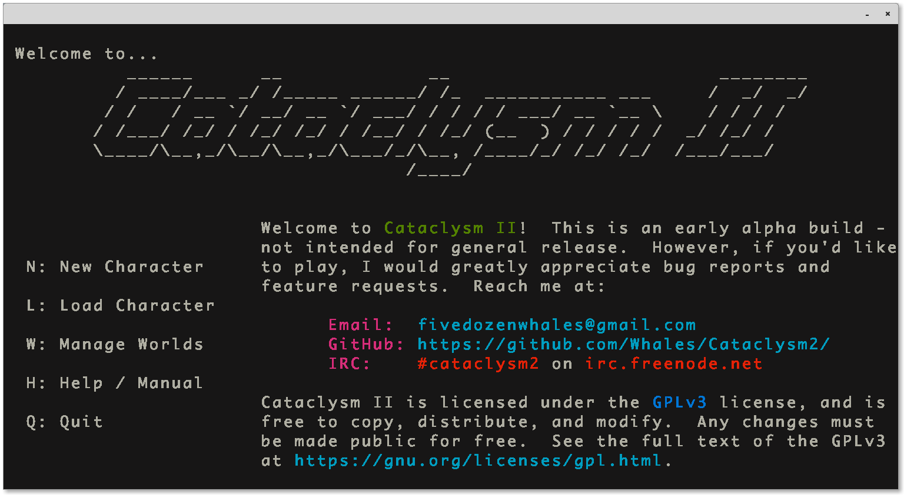
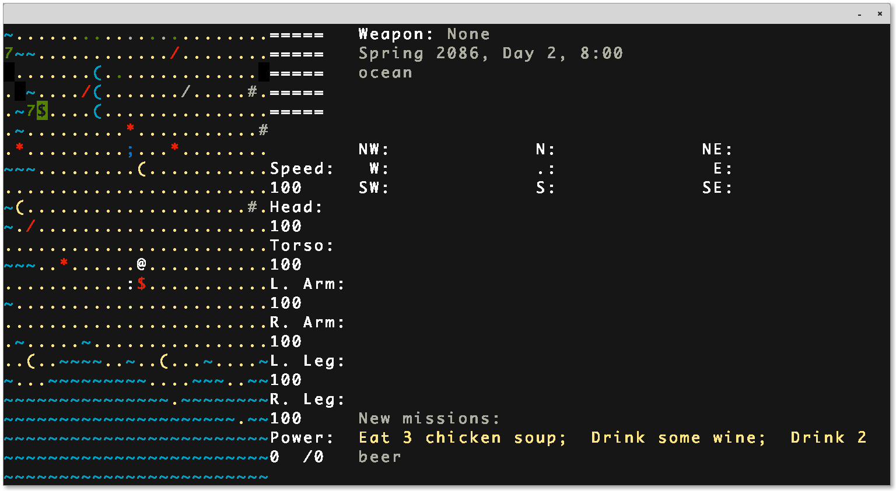
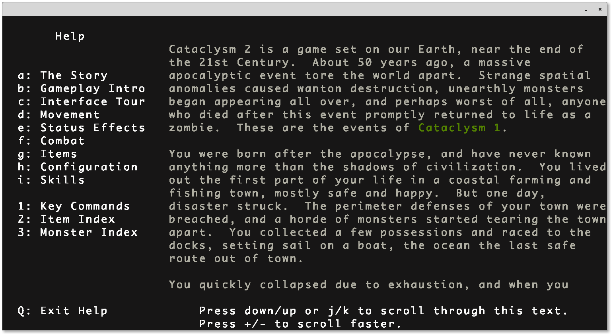
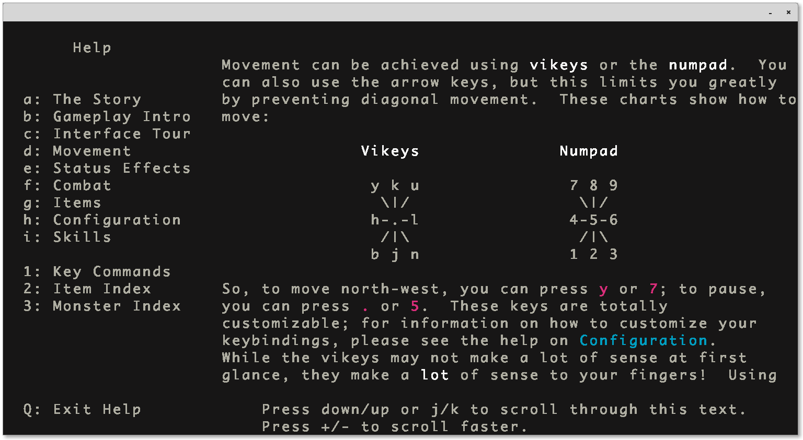
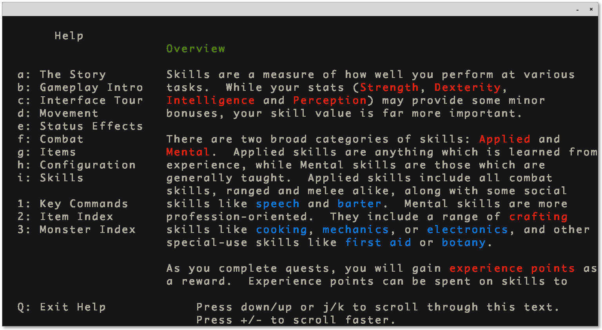
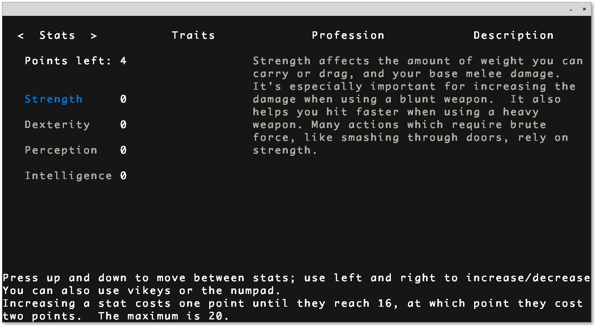

# Cataclysm 2

A sequel to [Cataclysm](https://github.com/Whales/Cataclysm).
It's a rewrite in many ways.
Please check out my [development blog](http://whalesdev.tumblr.com/) for notes on updates and my techniques.

# What is this project?

Cataclysm is a post-apocalyptic roguelike, set in the countryside of New England
after a devastating plague of monsters and zombies.

At present time, Cataclysm is still in early alpha, and is being developed very
rapidly.  As such, there are no formal version numbers, as a new version is
released every day, often several a day.

Cataclysm is very different from most roguelikes in many ways.  Rather than
being set in a vertical, linear dungeon, it is set in an unbounded, 3D world.
This means that exploration plays a much bigger role than in most roguelikes,
and the game is much less linear.

Because the map is so huge, it is actually completely persistant between games.
If you die, and start a new character, your new game will be set in the same
game world as your last.  Like in many roguelikes, you will be able to loot the
dead bodies of previous characters; unlike most roguelikes, you will also be
able to retrace their steps completely, and any dramatic changes made to the
world will persist into your next game.

While this makes for interesting depth of play, and the ability to "save" game
progress even after death, some prefer to start each game with a freshly
generated world.  This can be achieved by erasing the contents of the save
directory, found in the same folder as the executable.  "rm save/*" will erase
these files for you.

Cataclysm's gameplay also includes many unique quirks, and the learning curve is
somewhat steep, even for those experienced with roguelikes.  Included with the
game is a tutorial which runs the player through most of the key features.  The
game also has extensive documentation via the ? command.  Pressing ?1 will list
all the key commands, which is a good place to start.

# Refactor code?

Yes, new frontend based in [Doryen](https://github.com/Andres6936/Doryen) Library.

# Screenshots

    
    
    
    
    
    

